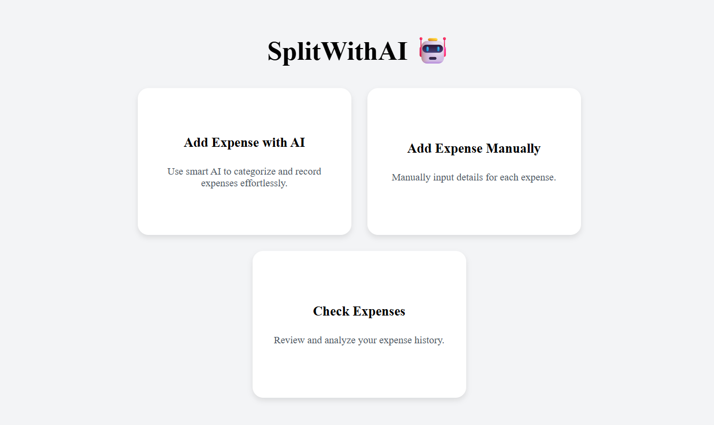
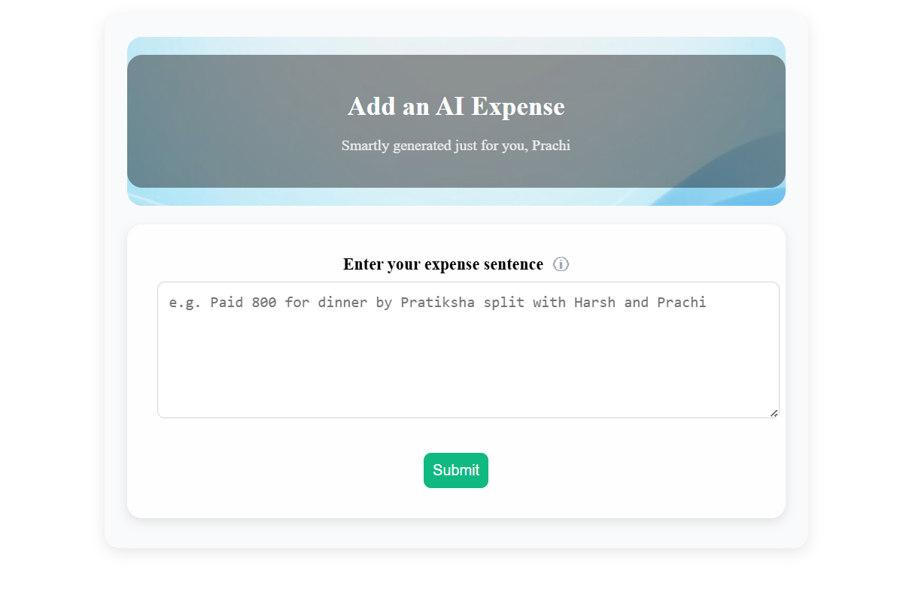
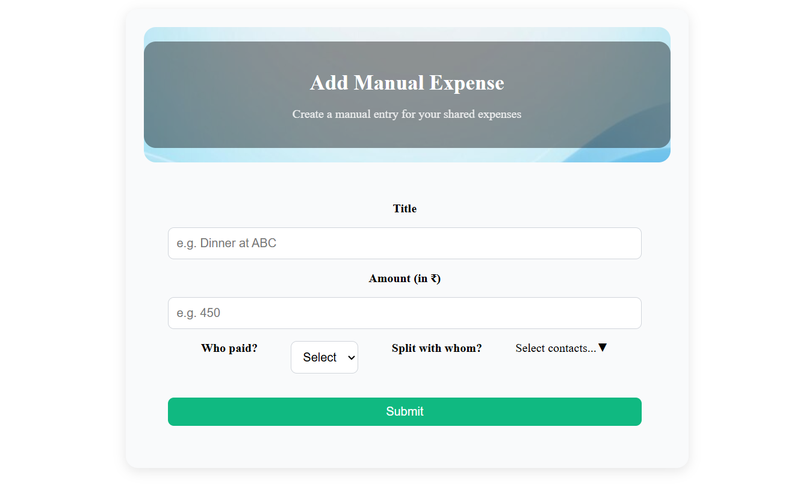
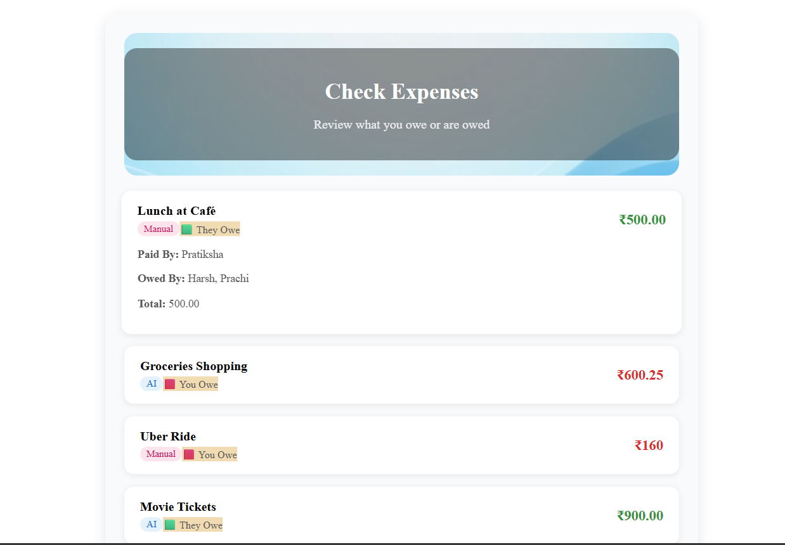

# 🧠 SplitWithAI

Welcome to **SplitWithAI** — your quirky, no-nonsense expense-splitting buddy that’s powered by AI (and good ol’ manual buttons too). Perfect for when you can't remember if you owe Harsh ₹200 or he owes you a coffee.

---

## 🚀 What It Does

Split expenses **the human way (manual)** or **the cool way (AI sentence like a text message)**. Track who paid, who owes, and how broke you’re going to be at the end of the month.

---

## 🎯 Features

### 💻 Frontend (React + TypeScript)

- 🤖 **AI-Powered Entry**  
  Type natural language like: _“Paid 1200 for trip by Pratiksha split with Harsh and Prachi”_

- ✍️ **Manual Entry**  
  For those who like drop-downs and being in control.

- 📋 **Check All Expenses**  
  Scroll through what you spent, who paid, and who's conveniently ignoring you.

- ✅ **Settle Up**  
  Show a "Settle Up" button if someone still owes you. Otherwise, enjoy the satisfying "Settled" label.

---

### 🧪 Backend (Python + Flask + Cohere AI)

- 🧠 **/api/expense/ai**  
  Parses your friendly natural sentence into structured data using Cohere AI + Pydantic.

- ✍️ **/api/expense/manual**  
  Straightforward endpoint to save manually entered expenses.

- 📦 **/api/expense**  
  Fetch all your shared cost drama from the DB.

- ✅ **/api/expense/<id>/settle**  
  Toggle the settled status like a boss.

---

### 🗄️ Database

- Using **MySQL** like it’s 2005 (but better).
- Visualized via **MySQL Workbench** because we like seeing things.

---

## 🧰 Tech Stack

| Layer     | Tech Used                        |
|-----------|----------------------------------|
| Frontend  | React, TypeScript, HTML, CSS     |
| Routing   | React Router DOM                 |
| Backend   | Flask, Pydantic, Cohere AI       |
| Database  | MySQL (Workbench for GUI)        |
| AI Magic  | Cohere's `/chat` endpoint        |

---

## 🗂️ Folder Structure

```
SplitWithAI/
├── frontend/                 # React app (TypeScript)
│   ├── src/
│   ├── public/
│   └── ...
├── backend/                 # Flask app
│   ├── app.py
│   ├── db.py
│   ├── requirements.txt
│   └── ...
└── README.md
```

---

## 🛠️ Getting Started

### 1. Clone the repo

```bash
git clone https://github.com/yourusername/SplitWithAI.git
cd SplitWithAI
```

### 2. Frontend Setup

```bash
cd frontend
npm install
npm start
```
Runs on: `http://localhost:3000`

### 3. Backend Setup

```bash
cd backend
pip install -r requirements.txt
python app.py
```
Runs on: `http://localhost:5000`

---

## 🧪 Sample API Endpoints

| Method | Endpoint                      | Description                        |
|--------|-------------------------------|------------------------------------|
| POST   | /api/expense/ai               | Add expense via AI sentence        |
| POST   | /api/expense/manual           | Add manual expense                 |
| GET    | /api/expense                  | Fetch all expenses                 |
| POST   | /api/expense/<id>/settle      | Mark an expense as settled         |

---

## 🔐 Environment Variables

In `backend/.env`:

```env
DATABASE_HOST=localhost
DATABASE_USER=root
DATABASE_PASSWORD=yourpassword
DATABASE_NAME=splitwithai
COHERE_API_KEY=your_cohere_key
```

---

## 📸 Sneak Peek

- 
- 
- 
- 
- 


---

## 🎯 Future Ideas

- User auth (because privacy matters)
- Contact syncing 
- Group-based splits (friends, family, enemies)
- Export to PDF or Excel
- Add reminders for unpaid friends (guilt trip as a feature 😅)

---

## 👩‍💻 Author

Crafted with ❤️ and caffeine by **Pratiksha Bhandari**  
[LinkedIn](https://www.linkedin.com/in/pratiksha-bhandari-042047194/) • [GitHub](https://github.com/pratiksha-learning/Splitwise-AI)

---